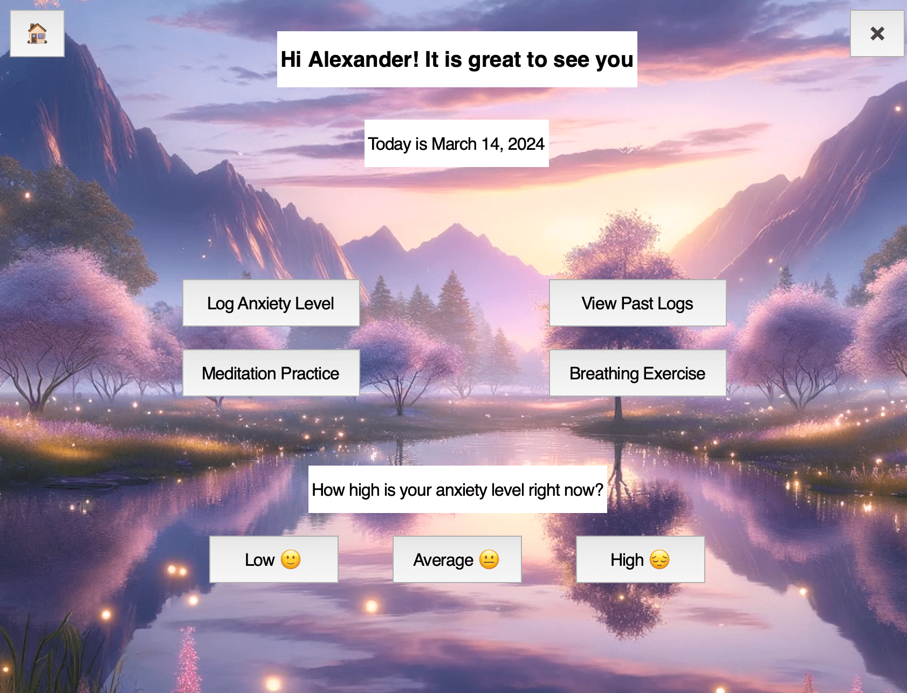

# Alexander Kozhin's Tech Basic II Exam project

This repository contains my Tech Basics II Exam Project code.

I have built an MVP for Serenity – Emotional Welness App. It has the following pages and features:

- When users run the `app.py` they are welcomed with **Homepage**, where the soothing music 🎵 starts playing and they can find 'Login' and 'Register' buttons.

  
- If this is the user's first time on the app, then they will click on the new 'Register' button and go to the **Registration** page. The user data is stored in a .csv file. For this MVP I am sharing my test users data, but I will take care of data privacy before I launch my app.

  - Once the user is registered, they can log in to their **Activities** page, which greets them with their name and the current date.

- On the **Activities** page, users can log their anxiety level – one of the key features of the app.

- Additionally, on the **Activities** page, users can access their past logs, accompanied by timestamps.

- One more feature of the app, users can certain activities to decrease their anxiety levels. On the **Meditation Practice** page 🎵, they can practice a singing bowls meditation, following the instruction on the screen and listening to the music.

- Lastly, users can do a breathing exercise to decrease their anxiety levels. On the **Breathing Exercise** page🎵, they are also provided with instruction and music.

- Please enjoy the app! :) And don't forget to turn on the sound to enjoy the app to the full! 🎵 
---
**The exam project repository contains the following:**
- The `Report` as a pdf file.
- The python code file `app.py` that carries out all the steps to build the MVP.
- The supporting python code file `helpers.py` in the folder `src`.
- The folder `user_data` with csv files to store `users` and their `anxiety_logs`.  
- The folders `images` and `music` for supporting files.  
- The `README` file.

